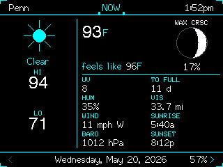
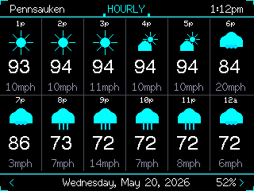
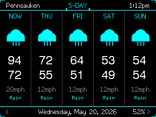
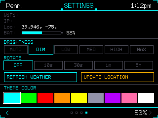

# xXCYD-Weather-StationXx

Tactical weather station for the ESP32-2432S028 (CYD / Cheap Yellow Display).



---

| Hourly | 5-Day Forecast | Settings |
|--------|---------------|----------|
|  |  |  |

---

### Features

- Current temperature, HI/LO, feels like, UV, humidity, wind, pressure, visibility
- Moon phase disk with illumination % and phase name, sunrise/sunset
- 12-hour hourly forecast and 5-day forecast
- Solar conditions screen with Kp index, solar wind, Bz, density, XRAY, FLR, CME, and 24-hour Kp history
- Wildfire screen using NASA EONET open wildfire events
- USGS earthquake screen showing recent M3.5+ activity
- Auto-detects location; no config needed beyond WiFi credentials
- Weather data via Open-Meteo; no API key required
- Refreshes at the top of each hour
- Auto-rotate cycles screens at configurable interval
- 9 theme accent colors and brightness control, saved across reboots

### Setup

Flash `firmware.bin` from the latest release, then provision WiFi from the SD card:

1. Create `wifi.txt` on the SD card.
2. Put your WiFi network name on line 1.
3. Put your WiFi password on line 2.
4. Insert the SD card and boot the CYD.
5. After the first successful boot, credentials are saved to NVS and the SD card can be removed.
6. Delete `wifi.txt` from the SD card.

### Build

Build from source with PlatformIO:

```bash
pio run --environment cyd_weather
```

The generated firmware is written to `.pio/build/cyd_weather/firmware.bin`.

### Credential Safety

- WiFi credentials are not committed to Git.
- The release firmware does not require an API key.
- Open-Meteo is used for weather data, so no weather service token is baked into the build.

---

*by xXQuantum-SmokeXx*
