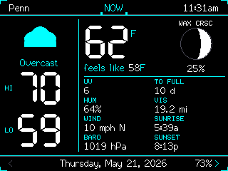
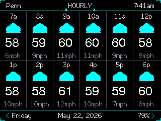
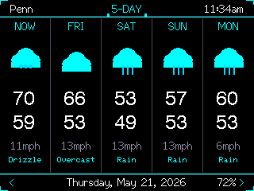
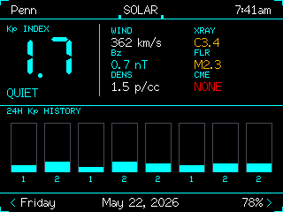
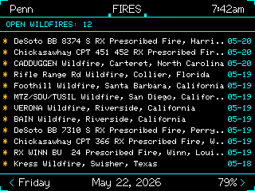
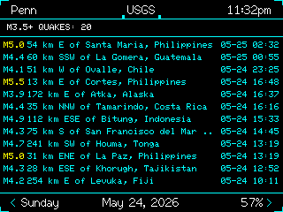
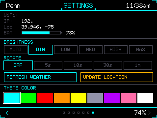

# xXCYD-Weather-StationXx

Tactical weather station for the ESP32-2432S028 (CYD / Cheap Yellow Display).

[](https://www.patreon.com/c/xXQuantumSmokeXx)

Built by xXQuantum-SmokeXx, with development assistance from Codex and Claude Code.

## Screens

### NOW


| HOURLY | 5-DAY | SOLAR |
|--------|-------|-------|
|  |  |  |

| FIRES | USGS | SETTINGS |
|-------|------|----------|
|  |  |  |

### Features

**NOW screen:**
- Current temperature with HI/LO and dynamic feels-like (heat index when hot/humid, wind chill when cold/windy)
- Temperature trend arrow (rising/falling)
- Weather icon and condition text
- UV index, humidity, wind speed with cardinal direction, barometric pressure (hPa), visibility, dew point
- Moon phase: phase name, illuminated disk graphic, illumination %, and days to full moon
- Sunrise and sunset times

**HOURLY screen:**
- 12-hour hourly forecast — hour, weather icon, temperature, wind speed

**5-DAY screen:**
- 5-day forecast — day name, weather icon, high/low temps, wind speed, condition text

**SOLAR screen:**
- Kp index with numeric value, condition text, and color-coded severity
- Solar wind speed, Bz/Bt magnetic field components, plasma density, solar wind temperature
- X-ray flux class, flare class and peak time, CME speed and detection time
- Aurora visibility label
- 24-hour Kp history bar chart

**FIRES screen:**
- NASA EONET wildfire events — up to 12 recent events with location and date

**USGS screen:**
- USGS earthquake feed — up to 12 recent M3.5+ events with magnitude, location, and time

**SETTINGS screen:**
- WiFi status and IP, city, NTP time sync status, weather provider info
- 6-step brightness — AUTO (LDR light sensor), DIM, LOW, MED, HIGH, MAX; saved across reboots
- Screen auto-rotate interval (off / 15s / 30s / 60s / 120s)
- Refresh Weather and Update Location buttons
- 9 theme accent colors, saved across reboots
- E-Ink mode — inverts display to white-background / black-foreground, toggled from the settings screen

**General:**
- Auto-detects location via IP geolocation; no config needed beyond WiFi credentials
- Weather data via Open-Meteo; no API key required
- Refreshes at the top of each hour
- Tap the title bar on SOLAR, FIRES, or USGS screens to force an immediate data re-fetch

### Setup

Flash `firmware.bin` from the latest release, then provision WiFi from the SD card:

1. Create `wifi.txt` on the SD card.
2. Put your WiFi network name on line 1.
3. Put your WiFi password on line 2.
4. Insert the SD card and boot the CYD.
5. After the first successful boot, credentials are saved to NVS and the SD card can be removed.
6. Delete `wifi.txt` from the SD card.

### Build

Build from source with PlatformIO:

```bash
pio run --environment cyd_weather
```

The generated firmware is written to `.pio/build/cyd_weather/firmware.bin`.

### Credential Safety

- WiFi credentials are not committed to Git.
- The release firmware does not require an API key.
- Open-Meteo is used for weather data, so no weather service token is baked into the build.