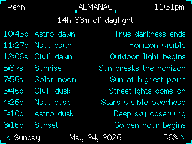
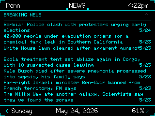

# xXCYD-Weather-StationXx

ESP32 CYD tactical monitoring station — real-time weather, space weather, solar day almanac, volcano activity tracking, wildfire & earthquake tracking, breaking news, WiFi scanner, customizable display profiles, and Somnus intelligent power management — instant deep-sleep with a single tap to wake.

[](https://www.patreon.com/c/xXQuantumSmokeXx)

## Screens

| NOW | ALMANAC | SETTINGS |
|-----|---------|----------|
|  |  |  |

| HOURLY | 5-DAY | SOLAR |
|--------|-------|-------|
|  |  |  |

| FIRES | USGS | NEWS |
|-------|------|------|
|  |  |  |

### Features

**NOW screen:**
- Current temperature with HI/LO and dynamic feels-like (heat index when hot/humid, wind chill when cold/windy)
- Temperature trend arrow (rising/falling)
- Weather icon and condition text
- UV index, humidity, wind speed with cardinal direction, barometric pressure (hPa), visibility, dew point
- Moon phase: phase name, illuminated disk graphic, illumination %, and days to full moon
- Sunrise and sunset times

**HOURLY screen:**
- 12-hour hourly forecast — hour, weather icon, temperature, wind speed

**5-DAY screen:**
- 5-day forecast — day name, weather icon, high/low temps, wind speed, condition text

**SOLAR screen:**
- Kp index with numeric value, condition text, and color-coded severity
- Solar wind speed, Bz/Bt magnetic field components, plasma density, solar wind temperature
- X-ray flux class, flare class and peak time, CME speed and detection time
- Aurora visibility label
- 24-hour Kp history bar chart
- Auto-refreshes at the top of each hour; tap title bar for manual refresh

**FIRES screen:**
- NIFC WFIGS active wildfire events — fire name, state, acreage, cause, and containment %
- Sorted newest-first, scrollable via swipe up/down
- Tap title bar to force a refresh
- Prescribed burns automatically filtered out

**USGS screen:**
- USGS earthquake feed — M3.5+ events with magnitude, location, and time
- Sorted newest-first, scrollable via swipe up/down
- Tap title bar to force a refresh; auto-refreshes every 15 minutes

**VOLCANOES screen:**
- USGS volcano activity — Yellowstone volcano tracking plus currently elevated volcanoes
- Color-coded status dot: GREEN (normal), YELLOW (advisory), ORANGE (watch), RED (warning)
- Two-line per volcano: name on top, observatory / alert level / last-update timestamp below
- Sorted newest-first; tap title bar to force a refresh
- Auto-refreshes on the hour

**NEWS screen:**
- Breaking news from r/news — crime, disasters, major incidents. Strictly moderated (no fluff, no opinion).
- Two-line headline format with word-boundary wrapping for readability
- Sorted newest-first by date
- Vertical swipe scrolling — up to 16 headlines, swipe up/down to page through all entries
- Tap title bar to force a data re-fetch; scroll position resets to top on refresh
- No API key required

**ALMANAC screen:**
- Solar day timeline calculated from GPS coordinates — no API needed
- 9 phases: astronomical dawn, nautical dawn, civil dawn, sunrise, solar noon, sunset, civil dusk, nautical dusk, astronomical dusk
- Each phase shows calculated time, phase label, and practical field note (e.g. "Horizon visible", "Golden hour begins")
- Daylight duration hero line at top (e.g. "10h 23m of daylight")
- Falls back to OpenWeatherMap sunrise/sunset times when available

**SCANNER screen:**
- WiFi AP radar — sweeping visualization of nearby access points with themed color
- Inner ring (strong signal) and outer ring (weak signal) with left/right labeled lists
- Auto-scans every 5 seconds; shows AP count and scanning status
- Node labels appear as the sweep line passes over each AP dot

**SETTINGS screen:**
- WiFi status and IP, city, NTP time sync status, weather provider info
- 6-step brightness — AUTO (LDR light sensor), DIM, LOW, MED, HIGH, MAX; saved across reboots
- Screen auto-rotate interval (off / 5s / 10s / 30s / 1m)
- 8 per-page rotation checkboxes — toggle which screens are included in auto-rotate
- Refresh Weather and Location buttons in a 2x2 grid next to E-Ink and Power Off
- 9 theme accent colors, saved across reboots
- E-Ink mode — inverts display to white-background / black-foreground, toggled from the settings screen
- Power Off — two-tap confirmation ("PWR OFF" → "SURE?") engages **Somnus Deep-Sleep Recovery**: ESP32 enters ultra-low-power deep sleep with EXT0 touch-IRQ wake on GPIO 36. A single screen tap reanimates the device instantly — no hardware reset required.

**General:**
- Auto-detects location via IP geolocation; no config needed beyond WiFi credentials
- Weather data via Open-Meteo; no API key required
- Refreshes at the top of each hour
- Tap the title bar on any screen to force an immediate data re-fetch (weather screens) or data-screen refresh (SOLAR, FIRES, USGS, NEWS)
- FIRES and USGS headline text uses the active theme color
- 11 screens total: NOW, HOURLY, 5-DAY, SOLAR, FIRES, USGS, VOLCANOES, NEWS, ALMANAC, SCANNER, SETTINGS

### Setup

Flash `firmware.bin` from the latest release, then provision WiFi from the SD card:

1. Create `wifi.txt` on the SD card.
2. Put your WiFi network name on line 1.
3. Put your WiFi password on line 2.
4. Insert the SD card and boot the CYD.
5. After the first successful boot, credentials are saved to NVS and the SD card can be removed.
6. Delete `wifi.txt` from the SD card.

### Build

Build from source with PlatformIO:

```bash
pio run --environment cyd_weather
```

The generated firmware is written to `.pio/build/cyd_weather/firmware.bin`.

### Credential Safety

- WiFi credentials are not committed to Git.
- The release firmware does not require an API key.
- Open-Meteo is used for weather data, so no weather service token is baked into the build.

Built by xXQuantum-SmokeXx, with development assistance from Codex and Claude Code.